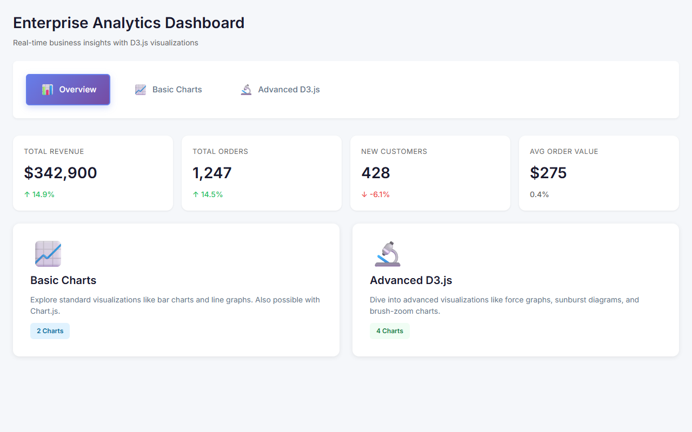

[README.md](https://github.com/user-attachments/files/26216618/README.md)
# 📊 Enterprise Analytics Dashboard

<div align="center">


**AI-Powered Enterprise Analytics Platform with Real-Time KPIs**

[Live Demo](https://enterprise-analytics-dashboard.vercel.app) · [View Code](https://github.com/Amrit004/enterprise-analytics-dashboard)

</div>



---

An enterprise-grade analytics platform featuring real-time KPIs, AI-powered predictions using linear regression, and interactive data visualizations built with Next.js and Recharts.

## 🚀 Features

| Feature | Description |
|---------|-------------|
| **Real-time KPI Tracking** | Live dashboard updates with animated counters |
| **AI Predictions** | Linear regression for trend forecasting |
| **Interactive Charts** | Line, bar, area, and pie charts with Recharts |
| **Traffic Analysis** | Source breakdown with geographic visualization |
| **Performance Metrics** | Response time, throughput, error rate tracking |
| **Memoized Rendering** | Optimized for large datasets |

## 🧰 Tech Stack

| Layer | Technology |
|-------|------------|
| Framework | Next.js 14 (App Router) |
| Language | TypeScript |
| Charts | Recharts |
| Animation | Framer Motion |
| Styling | Tailwind CSS |
| Icons | Lucide React |

## 📂 Project Structure

```
enterprise-analytics-dashboard/
├── src/
│   ├── app/
│   │   ├── layout.tsx    # Root layout with metadata
│   │   └── page.tsx      # Main dashboard
│   └── components/
│       ├── charts/       # Recharts components
│       ├── kpi/          # KPI cards
│       └── ui/           # Shared components
├── tailwind.config.ts
├── next.config.mjs
└── package.json
```

## ⚡ Quick Start

```bash
git clone https://github.com/Amrit004/enterprise-analytics-dashboard.git
cd enterprise-analytics-dashboard
npm install
npm run dev
open http://localhost:3000
```

---

<div align="center">

**Built by Amritpal Singh Kaur**

[LinkedIn](https://linkedin.com/in/amritpal-singh-kaur-b54b9a1b1) · [GitHub](https://github.com/Amrit004) · [Portfolio](https://apsk-dev.vercel.app)

</div>
